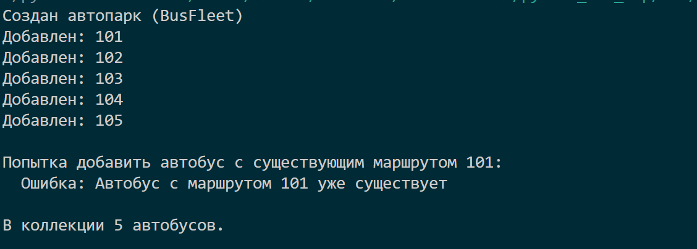

# Лабораторная работа №2.Коллекция объектов.Вариант №5.

## Цель работы

Научиться работать с коллекциями объектов.
Понять разницу между моделью сущности и контейнером объектов.
Реализовать собственный контейнерный класс.
Освоить итерацию по объектам.
Реализовать базовые операции управления коллекцией.

## Краткое описание
В работе использован класс `Bus` из первой лабораторной работы (автобус с номером маршрута, вместимостью, пассажирами и состоянием). Реализован класс-контейнер `BusFleet`, который управляет группой автобусов. Валидация вынесена в отдельный модуль `validation.py`.

## Класс BusFleet (коллекция)

### Атрибуты

- `_items` – внутренний список объектов `Bus`.

### Основные методы

- `add(bus)` – добавляет автобус (проверяет тип и уникальность маршрута).
- `remove(bus)` – удаляет автобус по объекту.
- `remove_at(index)` – удаляет по индексу, возвращает удалённый объект.
- `get_all()` – возвращает копию списка.

### Поиск и фильтрация

- `find_by_route(route)` – возвращает первый автобус с указанным маршрутом.
- `find_all_by_status(status)` – возвращает новую коллекцию автобусов с заданным статусом.
- `find_all_with_passengers()` – возвращает коллекцию автобусов, в которых есть пассажиры.

### Сортировка

- `sort_by_route(reverse=False)`
- `sort_by_capacity(reverse=False)`
- `sort_by_passengers(reverse=False)`

### Магические методы

- `__len__` – поддержка `len()`.
- `__iter__` – поддержка `for`.
- `__getitem__` – поддержка индексации и срезов.
- `__str__`, `__repr__` – строковое представление.

## Сценарии

# Сценарий 1: Создание автопарка и добавление автобусов

Что происходит:
Создаются пять автобусов с разными маршрутами, вместимостью, количеством пассажиров и состояниями. Каждый автобус добавляется в коллекцию BusFleet. 
При успешном добавлении выводится сообщение Добавлен: <маршрут>.

Проверка дубликата: после добавления всех пяти автобусов предпринимается попытка добавить ещё один автобус с уже существующим маршрутом 101. 

Коллекция не допускает дублирования – выбрасывается исключение ValueError, которое перехватывается, и выводится сообщение: Ошибка: Автобус с маршрутом 101 уже существует.

